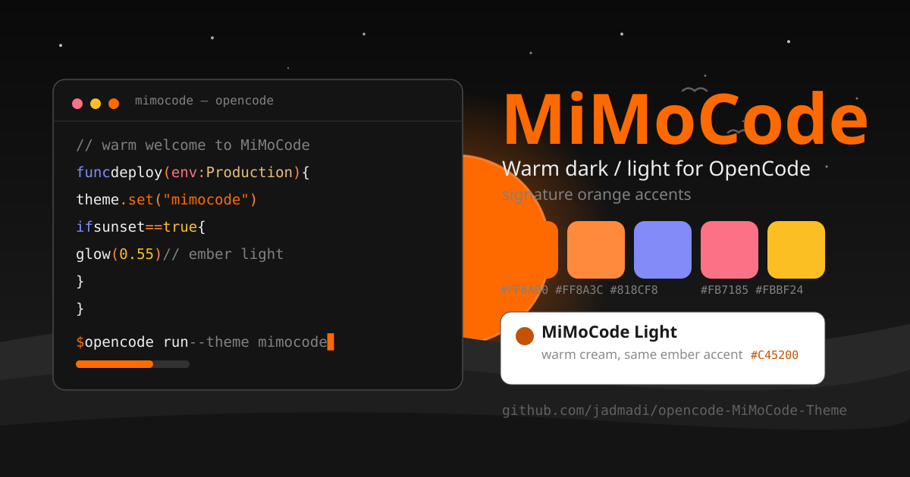

# MiMoCode Theme for OpenCode

Warm dark and light theme for [OpenCode](https://opencode.ai) with
signature orange accents. Ported from
[zed-mimoCode-theme](https://github.com/jadmadi/zed-mimoCode-theme).
Brand inspired by [Xiaomi's MiMo-Code](https://github.com/XiaomiMiMo/MiMo-Code).
Unofficial fan theme, no affiliation.



Dark mode uses warm-black surfaces with vivid orange, indigo, and amber
accents. Light mode uses warm cream surfaces with the same accent family.

by Jad Madi, [X / @jadmadi](https://x.com/jadmadi),
[GitHub / jadmadi](https://github.com/jadmadi)

## Install

Create the themes directory if it does not exist:

```bash
mkdir -p ~/.config/opencode/themes
```

Download the theme file:

```bash
curl -o ~/.config/opencode/themes/mimocode.json \
  https://raw.githubusercontent.com/jadmadi/opencode-MiMoCode-Theme/main/mimocode.json
```

Set the theme in `~/.config/opencode/opencode.json`:

```json
{
  "theme": "mimocode"
}
```

Restart OpenCode.

## Colors

| Element    | Dark      | Light     |
| ---------- | --------- | --------- |
| Background | `#0a0a0a` | `#ffffff` |
| Foreground | `#eeeeee` | `#1a1a1a` |
| Primary    | `#FF6A00` | `#C45200` |
| Accent     | `#818CF8` | `#4338CA` |
| Error      | `#FB7185` | `#E11D48` |
| Warning    | `#FBBF24` | `#B45309` |

## Referrals

New to OpenCode? Sign up with my link:
https://opencode.ai/go?ref=N9H3ZEP22A

Trying Xiaomi MiMo? Bind invite code `8ACN29` for 10 percent off
your first paid Token Plan order:
https://platform.xiaomimimo.com?ref=8ACN29

## License

MIT, see [LICENSE](LICENSE).
